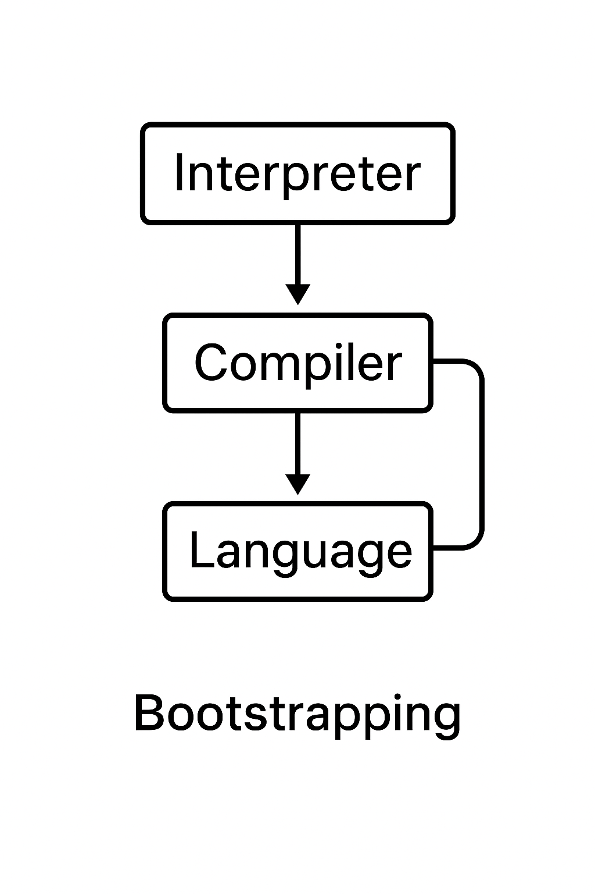

# Questionário

### Web page by Gemini
https://gemini.google.com/share/fe94945071ae

### 1. O que vem a ser um compilador? Podemos dizer que um compilador é uma máquina de Turing? Neste caso, faz sentido dizer que uma linguagem de programação deva ser uma linguagem decidível?
Um compilador é uma máquina de tradução de um texto escrito A (entrada) para outro texto escrito B (saída), sendo o texto B semanticamente equivalente ao texto A, caso o texto A esteja correto.

Sim, podemos considerar um compilador como uma máquina de Turing
O compilador é um programa que aceita uma entrada finita e realiza transformações computacionais sobre ela, e pode parar em todas as circunstâncias.
Como uma MT é um modelo universal de computação, qualquer compilador pode ser modelado como uma MT.

Uma linguagem de programação deva ser uma linguagem decidível, pois o compilador precisa responder de forma determinística e finita se uma entrada pertence ou não à linguagem.

### 2. O que vem a ser um compilador bootstraping? Ilustre sua resposta com um exemplo prático de como se criar um compilador.
É um compilador construído na própria linguagem que ele compila



### 3. Qual o papel de um analisador léxico num compilador? Podemos dizer que um parser é um decisor sintático de uma linguagem de programação? Justifique.
Receber uma sequência de carateres e, enquanto reconhecer como padrão atendido pela sequência de carateres, os transformar em tokens para o analisador sintático.

Podemos dizer que um parser é um decisor sintático de uma linguagem de programação? Justifique
Sim, pois o parser recebe uma entrada de tokens e verifica se eles formam uma sentença válida conforme a gramática da linguagem, aceitando se a sentença pertencer à gramatica ou a rejeitando caso contrário.

### 4. Qual a importância da tabela de símbolos no processo de compilação? Ilustre um exemplo envolvendo uma variável C.
Qual a importância da tabela de símbolos no processo de compilação?
A tabela de símbolos atua como um "dicionário" onde o compilador consulta e atualiza durante quase todas as suas fases, armazenando informações como nome de variáveis, funções, classes, etc...

Considere o exemplo abaixo:

```
void calculate() {
    int number = 2;
}
```

A tabela seria populada conforme abaixo:

| Nome      | Tipo      | Escopo    | Atributos                |
|-----------|-----------|-----------|--------------------------|
| calculate | function  | global    | retorna void, 0 params   |
| number    | int       | calculate | -                        |

### 5. Com base no que foi explicado e do seu conhecimento de teoria da computação, faça a seguinte abstração: como a sequência lexer, parser, analisador semântico e gerador de código se classificaria na hierarquia de Chomsky?

#### Tipo 0: Geração de Código
A tradução final vai transformar o programa para outra forma, aplicando algoritmos arbitrários para tradução e otimização, o que exige o uso de gramáticas RE

#### Tipo 1: Análise Semântica
Verifica regras contextuais, como tipos de variáveis, o que exige gramáticas sensíveis ao contexto

#### Tipo 2: Parser
Baseia-se em gramáticas livres do contexto, como
```
Expr --> Term | Expr + Term
```

#### Tipo 3: Lexer
O lexer utiliza de expressões regulares, sendo o tipo mais simples na hierarquia

---

#### Hierarquia de Chomsky

Tipo 0: Gramáticas recursivamente enumerável

Tipo 1: Gramáticas sensíveis ao contexto

Tipo 2: Gramáticas livres de contexto

Tipo 3: Gramáticas regulares