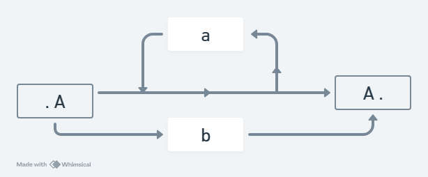

# Questionário

### Web page by Gemini
https://gemini.google.com/share/fe94945071ae

### 1. O que é um diagrama sintático e qual sua vantagem no projeto de um analisador sintático?
Um diagrama sintático é uma representação gráfica da sintaxe de uma linguagem, facilitando a visualização de suas regras gramaticais.

Também serve de alternativas para notações textuais como BNF e EBNF.

---
### 2. Diagrama sintático pode ser utilizado no desenvolvimento de um analisador léxico?
Sim, pois podem definir a estruturação de tokens, substituindo terminais pelos caracteres literais ('a', '1', ...), e não-terminais por classes de palavras ('letra', 'dígito')

---
### 3. De que modo a expressão regular a* | b seria representada num diagrama sintático?

---
### 4. Podemos afirmar que gramáticas EBNF são facilmente transliteradas para diagramas sintáticos? Justifique
Sim, pois seus operadores tem correspondência direta com as estruturas dos diagramas, uma vez que a EBNF expressa loops e opcionalidade de maneira concisa, sem a necessidade de ter não-terminais auxiliares.